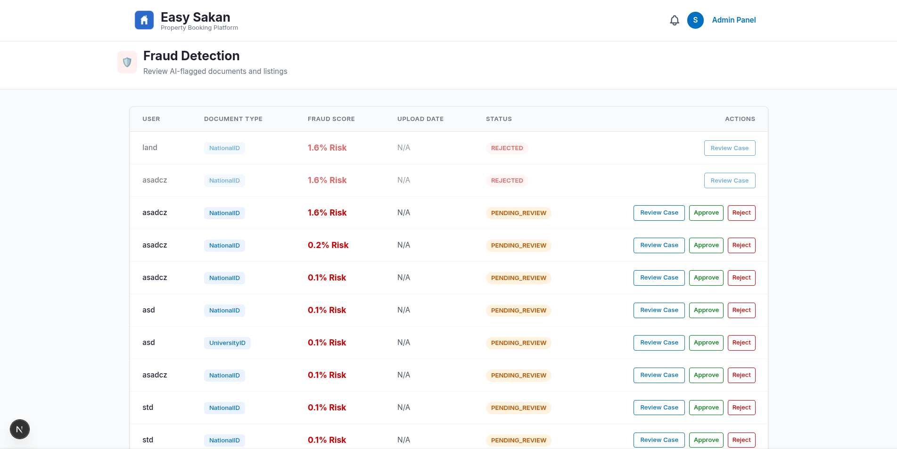

# Easy-Sakan-AI

AI features and machine learning micro-services for the Easy-Sakan student housing platform.

---
 
## 🖥️ System Integration & UI Preview
 
The AI micro-services are fully integrated into the Easy Sakan Next.js frontend via FastAPI, providing real-time data processing and autonomous decision-making.
 
### 1. Automated Fraud Detection Dashboard

*Admin view of AI-flagged documents. The pipeline short-circuits to reject forged documents while sending suspicious ones for manual review with detailed Risk Scores.*
 
### 2. AI-Powered Market Pricing & Deal Ratings

*Real-time XGBoost predictions evaluating whether properties are underpriced (Best Deal) or overpriced compared to the mathematical market average.*
 
---

## Structure

```text
easy-sakan-ai/
├── ai_verification_engine/
│   ├── 01_research_and_prototyping/
│   │   ├── assets/                           # Performance charts (PR curve, Confusion Matrix, etc.)
│   │   ├── build_yolo_dataset.py             # Generates synthetic stamped documents for YOLO training
│   │   ├── generate_mock_dataset.py          # Generates test/mock documents for pipeline validation
│   │   ├── train_yolo.py                     # Trains YOLOv8 stamp detection model
│   │   ├── test_yolo.py                      # Local testing script for evaluating the YOLO model alone
│   │   ├── test_stamp.py                     # Legacy baseline approach using traditional OpenCV methods
│   │   ├── fraud_pipeline_tester.py          # End-to-end testing script for all 6 verification vectors
│   │   └── stamp_data.yaml                   # YOLO dataset configuration
│   ├── 02_production_service/
│   │   ├── stamp_detector.pt                 # Serialized best YOLO weights
│   │   ├── document_ai_service.py            # Core engine class combining all ML/CV techniques
│   │   ├── verification_logic.py             # Fuzzy name matching and cross-referencing logic
│   │   └── api_router_extract.py             # FastAPI POST /upload-verification router reference
│   └── README.md
├── price_predictor/
│   ├── 01_research_and_prototyping/
│   │   ├── generate_data.py                  # Generates 5000-property physically chained mock dataset
│   │   ├── predictor.py                      # Trains XGBoost model, prints metrics & exports .joblib artifact
│   │   └── student_housing_train.csv         # Generated training dataset (auto-overwritten on re-run)
│   ├── 02_production_service/
│   │   ├── easysakan_price_predictor.joblib  # Serialized trained model binary (copied to backend root)
│   │   └── api_router_extract.py             # FastAPI POST /ml/predict-price router reference
│   └── README.md
├── recommendation_engine/
│   ├── 01_research_and_prototyping/
│   │   ├── generate_data.py                  # Generates student-property interaction dataset
│   │   ├── recommender.py                    # Implements cosine similarity pipeline & evaluates output
│   │   └── student_housing_data.csv          # Generated interaction dataset (auto-overwritten on re-run)
│   ├── 02_production_service/
│   │   ├── recommendation_service.py         # Pure-Python engine deployed into backend/app/services/
│   │   └── api_router_extract.py             # FastAPI GET /properties/recommended router reference
│   └── README.md
├── requirements.txt
└── README.md
```

Each subdirectory is a self-contained AI module. New models will be added here as separate folders.

---

## Modules

| Module | Description | Status |
|---|---|---|
| `ai_verification_engine` | Multi-layered automated verification pipeline — uses YOLOv8, Surya OCR, Computer Vision (ELA, Haar Cascades), and Metadata Forensics to detect identity fraud and document forgery. | ✅ Ready |
| `recommendation_engine` | Content-based filtering — recommends similar apartments using cosine similarity on price, location, area, and amenities. | ✅ Ready |
| `price_predictor` | XGBoost regression engine — predicts fair market rent dynamically based on capacity, location, and physical properties. | ✅ Ready |

---

## Setup

Install all dependencies for every module from the root:

```bash
pip install -r requirements.txt
```

Then navigate into any module and follow its own `README.md` for usage instructions.