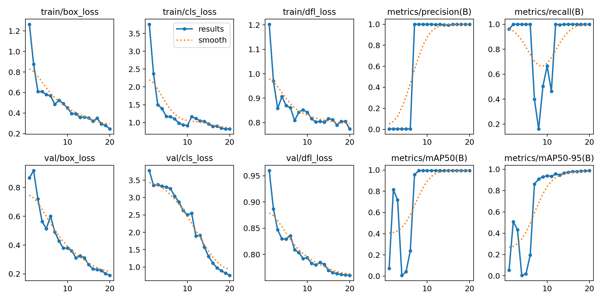
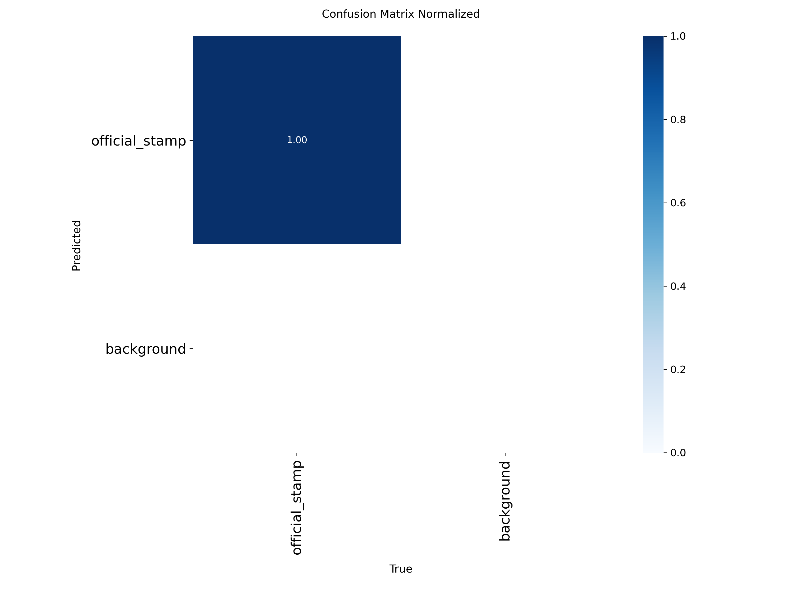
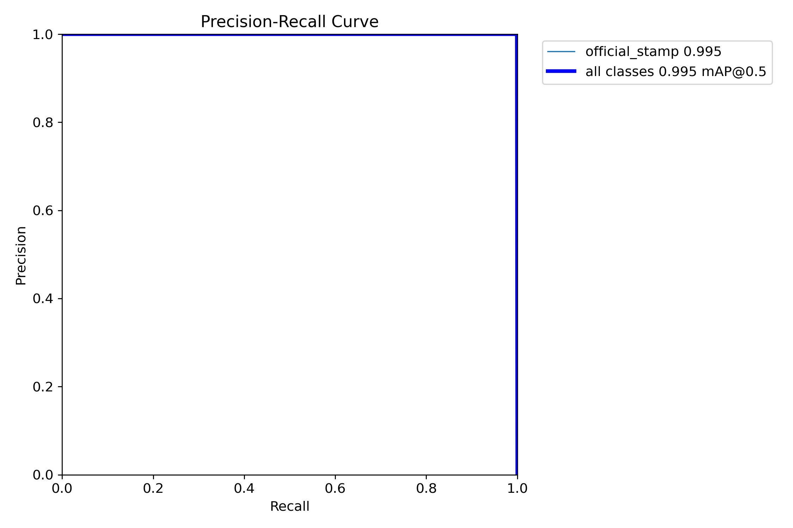
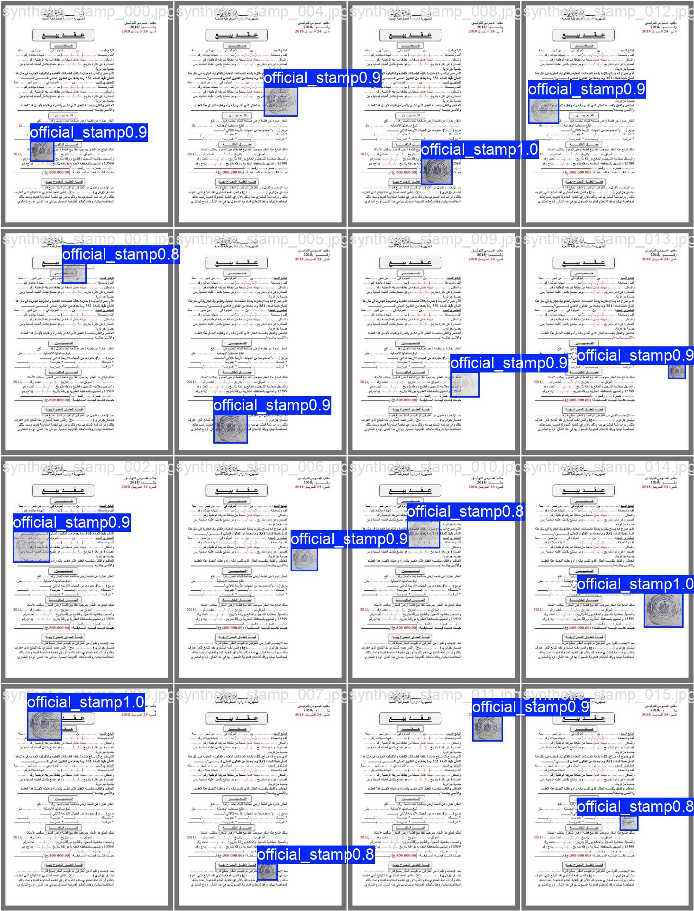

# AI Document Verification Engine

An enterprise-grade, multi-layered Automated Verification Engine built to prevent identity theft and platform fraud on the Easy Sakan platform. This module processes uploaded documents — National IDs, University IDs, and Property Deeds — through a rigorous series of security vectors before routing them to the Admin Dashboard.

---
 
## 🖥️ UI Integration & Dashboard
 
### Admin Users Dashboard

*Every submitted document appears here, not just flagged ones. Clean documents that pass all 6 vectors are shown too, each labeled with its current status: APPROVED, PENDING_REVIEW, or REJECTED. The backend also applies a strict "Fail-Closed" security policy—if any AI component crashes, the document is automatically flagged for review.*
 
### Dynamic Document Routing


*The frontend dynamically requests different documents based on the user role. The AI engine applies strict Stamp Detection rules only to Property Deeds, while Face Detection is enforced on IDs.*
 
---

## 🛡️ System Architecture — The 6 Vectors

To ensure high accuracy and minimize false positives, the engine uses a short-circuiting logic architecture across six distinct verification checks:

| Vector | Name | Technique |
|---|---|---|
| A | Syntactic Manipulation | Mathematical Error Level Analysis (ELA) via OpenCV to detect digital pixel manipulation, splicing, and compression artifacts. |
| B | Authority Forgery | Custom YOLOv8 object detection trained on synthetic datasets to verify the presence of physical government and institutional stamps. |
| C | Data Extraction | Surya OCR for high-accuracy Arabic text extraction, capable of handling poor lighting and complex background holograms. |
| D | Identity Cross-Referencing | Custom Set Intersection algorithm to strictly match normalized Arabic names across multiple documents (e.g., verifying a Student's National ID matches their University ID). This engine filters out institutional stop-words and requires a minimum of 3 unique overlapping name tokens to pass. |
| E | Metadata Forensics | Extraction and analysis of hidden EXIF metadata to identify software-based document editing signatures (e.g., Photoshop, PicsArt). |
| F | Biometric Sanity Check | OpenCV Haar Cascades to verify the presence of a natural human face within the document, blocking stickers, emojis, and non-human artifacts. |

> **Short-Circuit Logic:** Documents that fail hard checks (Vectors E or F) are immediately flagged as `REJECTED_FORGERY_DETECTED` to save server compute. Ambiguous documents receive a calculated `fraudScore` and are routed to `PENDING_REVIEW` for manual Admin resolution.

---

## 📊 Model Performance & Validation

The YOLOv8 model was custom-trained to detect official Egyptian government and institutional stamps. It achieved exceptional results across all validation metrics.

### Training Curves & Loss



Training curves show a consistent decrease in bounding box and classification loss across all epochs, with mAP50 stabilizing at near **99.5%**.

### Confusion Matrix



The normalized confusion matrix demonstrates a **1.00 (100%) true positive rate** on the validation set, with zero background misclassifications.

### Precision-Recall Curve



The PR curve AUC approaches **1.0**, indicating optimal trade-offs between precision and recall across all confidence thresholds.

### Visual Inference — Validation Batch



Real-time inference on the validation set demonstrating tight bounding boxes and high confidence scores **(> 0.8)** across all detected stamps.

---

## 🗂️ Directory Structure

```text
ai_verification_engine/
├── 01_research_and_prototyping/
│   ├── assets/                    # Performance charts (PR curve, Confusion Matrix, etc.)
│   ├── build_yolo_dataset.py      # Generates synthetic stamped documents for YOLO training
│   ├── generate_mock_dataset.py   # Generates test/mock documents for pipeline validation
│   ├── train_yolo.py              # Trains YOLOv8 stamp detection model
│   ├── test_yolo.py               # Local testing script for evaluating the YOLO model alone
│   ├── test_stamp.py              # Legacy baseline approach using traditional OpenCV methods
│   ├── fraud_pipeline_tester.py   # End-to-end testing script for all 6 verification vectors
│   └── stamp_data.yaml            # YOLO dataset configuration
├── 02_production_service/
│   ├── stamp_detector.pt          # Serialized best YOLO weights
│   ├── document_ai_service.py     # Core engine class combining all ML/CV techniques
│   ├── verification_logic.py      # Set intersection logic and name cross-referencing
│   └── api_router_extract.py      # FastAPI POST /upload-verification router reference
└── README.md
```

---

## 🚀 Production Deployment

The assets in `02_production_service/` represent the final exported logic currently running in the FastAPI backend environment.

| File | Role |
|---|---|
| `stamp_detector.pt` | Finalized, serialized YOLOv8 weights ready for inference. |
| `document_ai_service.py` | Core wrapper class that orchestrates the full 6-vector pipeline. |
| `verification_logic.py` | Isolated set intersection and cross-referencing logic for identity validation. |
| `api_router_extract.py` | Reference extract showing how the HTTP layer interfaces with the AI service and routes documents based on the deterministic fraud score. |

---

## ⚡ Quick Start

From the repository root, install all dependencies:

```bash
pip install -r requirements.txt
```

To run the full end-to-end pipeline test:

```bash
cd ai_verification_engine/01_research_and_prototyping
python fraud_pipeline_tester.py
```

To evaluate the YOLO stamp detector in isolation:

```bash
python test_yolo.py
```