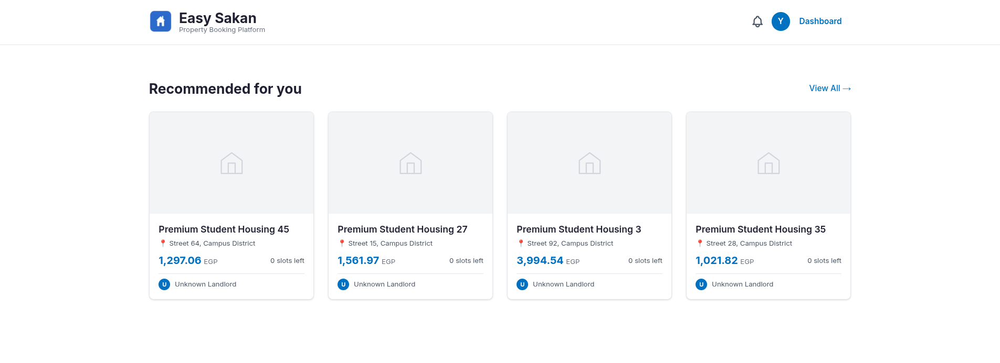

# Recommendation Engine

A content-based filtering engine that recommends student apartments based on price, location (nearest university), area, and amenities.

The engine went through two phases: an offline research prototype and a production service integrated into the Easy Sakan FastAPI backend.

---
 
## 🖥️ UI Integration
 
### Personalized Student Dashboard

*The frontend dynamically displays the Top 4 recommended properties based on the user's latest interaction session (views, saves, or bookings). Calculations are performed strictly On-The-Fly to ensure real-time personalization.*
 
---

## How It Works

The model represents each apartment as a numeric vector and uses **cosine similarity** to find the most similar listings to a given target property.

### Pipeline

```
Raw CSV Data
    │
    ▼
Feature Engineering
    ├── Price & Area       → MinMax scaled to [0, 1]
    ├── Nearest University → One-hot encoded
    └── Amenities          → Multi-label binarized
    │
    ▼
Weighted Feature Matrix
    ├── price_scaled  × 2.0   (highest priority)
    ├── univ_*        × 1.5   (strong location signal)
    ├── amenities_*   × 1.0   (standard)
    └── area_scaled   × 0.5   (minor influence)
    │
    ▼
Cosine Similarity Matrix  (100 × 100)
    │
    ▼
get_recommendations(target_id, top_n)
```

### Why Cosine Similarity?

It measures the **angle** between two feature vectors rather than their magnitude, so a large apartment and a small one can still match perfectly if their relative feature profiles are aligned. This works well for mixed numeric/binary feature spaces.

---

## Structure

```
recommendation_engine/
├── 01_research_and_prototyping/   # Offline prototype using Scikit-Learn & Pandas
│   ├── generate_data.py
│   ├── mock_properties.csv
│   └── recommender.py
└── 02_production_service/         # Pure-Python service integrated into FastAPI backend
    ├── recommendation_service.py
    └── api_router_extract.py
```

### Phase 01 — Research & Prototyping

| File | Description |
|---|---|
| `generate_data.py` | Generates `mock_properties.csv` with 100 synthetic listings |
| `mock_properties.csv` | Mock dataset (100 apartments, 7 columns) |
| `recommender.py` | Core model — feature engineering, similarity matrix, recommendation function, and metrics |

### Phase 02 — Production Service

After validating the algorithm in the prototype, the logic was translated into a **pure-Python service** with no Scikit-Learn or Pandas dependency. This keeps the FastAPI Docker image lightweight and delivers sub-5ms response times.

| File | Description |
|---|---|
| `recommendation_service.py` | Core scoring logic against live SQLAlchemy ORM models. Handles cold-start fallback for new users with no interaction history. |
| `api_router_extract.py` | FastAPI router that exposes `GET /properties/recommended`. Handles pagination, JWT-based auth via dependency injection, and wraps results in the platform's standard JSON envelope. |

**Key differences from the prototype:**

| | Prototype | Production |
|---|---|---|
| **Similarity method** | Cosine similarity matrix (Scikit-Learn) | Weighted scoring function (pure Python) |
| **Amenities matching** | Multi-label binarization | Jaccard similarity |
| **Data source** | CSV file | PostgreSQL via SQLAlchemy |
| **Cold start** | Not handled | Falls back to newest listings |
| **Auth** | None | JWT via `get_current_user` dependency |
| **Output** | Console print | Paginated JSON API response |

---

## Usage

### Prototype

**Step 1 — Generate (or replace) the dataset:**
```bash
python 01_research_and_prototyping/generate_data.py
```

**Step 2 — Run the recommender:**
```bash
python 01_research_and_prototyping/recommender.py
```

To query a different property, change `target_property_id` at the bottom of `recommender.py`:
```python
target_property_id = 42  # any id from 1–100
```

### Production API

The endpoint is mounted on the Easy Sakan FastAPI backend. Once the server is running:

```
GET /properties/recommended?page=1&pageSize=10&basedOn=views
```

| Query param | Default | Options |
|---|---|---|
| `page` | `1` | any positive int |
| `pageSize` | `10` | 1–20 |
| `basedOn` | `views` | `views`, `saves`, `bookings` |

Requires a valid JWT in the `Authorization` header. The recommendation target is derived automatically from the authenticated user's most recent interaction of the specified type.

---

## Tuning the Weights

### Prototype

Edit the multipliers in `recommender.py`:

```python
feature_matrix = pd.concat([
    df[['price_scaled']] * 2.0,   # ← increase to make price dominate
    df[['area_scaled']]  * 0.5,   # ← increase to surface larger units
    univ_dummies         * 1.5,   # ← high value keeps results near same university
    amenities_encoded    * 1.0,
], axis=1)
```

### Production

Edit the `weights` dict in `recommendation_service.py`:

```python
weights = {
    "price":      0.4,
    "university": 0.3,
    "amenities":  0.3,
}
```

---

## Metrics

Measured on the prototype against 100 listings:

| Metric | Recorded value | What it means |
|---|---|---|
| **Execution Time** | 0.0020s | Well under the 0.01s target for 100 listings — will scale comfortably to larger catalogs |
| **Catalog Coverage** | 100% (100/100) | Every listing in the dataset appears in at least one recommendation list — no popularity bias |
| **Intra-List Diversity** | ±1238.92 EGP | Healthy spread; the model is not surfacing near-identical price clones |

---

## Dataset Schema

| Column | Type | Description |
|---|---|---|
| `id` | int | Unique listing identifier |
| `title` | string | Display name |
| `price` | int | Monthly rent in EGP |
| `nearest_university` | string | One of 5 Cairo universities |
| `bedrooms` | int | 1–3 |
| `area_sqm` | int | 50–150 m² |
| `amenities` | JSON array | Subset of 8 possible amenities |